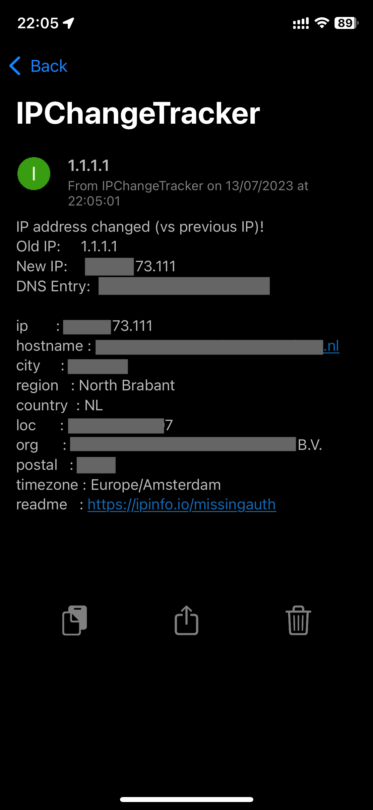

# IPChangeTracker
Track your local WAN IP for changes. 
It will keep track on your current WAN IP and notifies when it has changed. 

This check will happen every hour (5 minutes past every hour). You can [change the schedule here](Function%20Apps/IPChangeTracker/function.json).
Notifications will be send via [pushover.net](https://pushover.net/) (a (free) account is required)

Optionally you can define a DNS address to determine a mismatch. You will receive a notification if your IP address has been changed versus your DNS address.

## Screenshot

# Prerequisites
1. [pushover.net](https://pushover.net/) account
2. API key, you can [create one here](https://pushover.net/apps/build)
2. User key, you can [find it on the frontpage of pushover](https://pushover.net/)
1. [Docker-Compose (or docker)](https://docs.docker.com/compose/)
1. You need an Azure functions container. More info: [Azure Functions Powershell](https://hub.docker.com/_/microsoft-azure-functions-powershell)
# Azure function app (PowerShell)
This function app will run the script every hour.
Look at the [docker-comopose.yml](docker-compose.yml) for the docker setup that contains:
1. Azure Functions container
## Next steps
1. Download the [Function Apps](Function%20Apps) folder to '/home/{USER}/Function Apps'
1. Download the [.env.azfunc](.env.azfunc) file next to your **docker-compose.yml** file
1. Update the **.env.azfunc** file with its environment variables (like Pushover API key and User key)